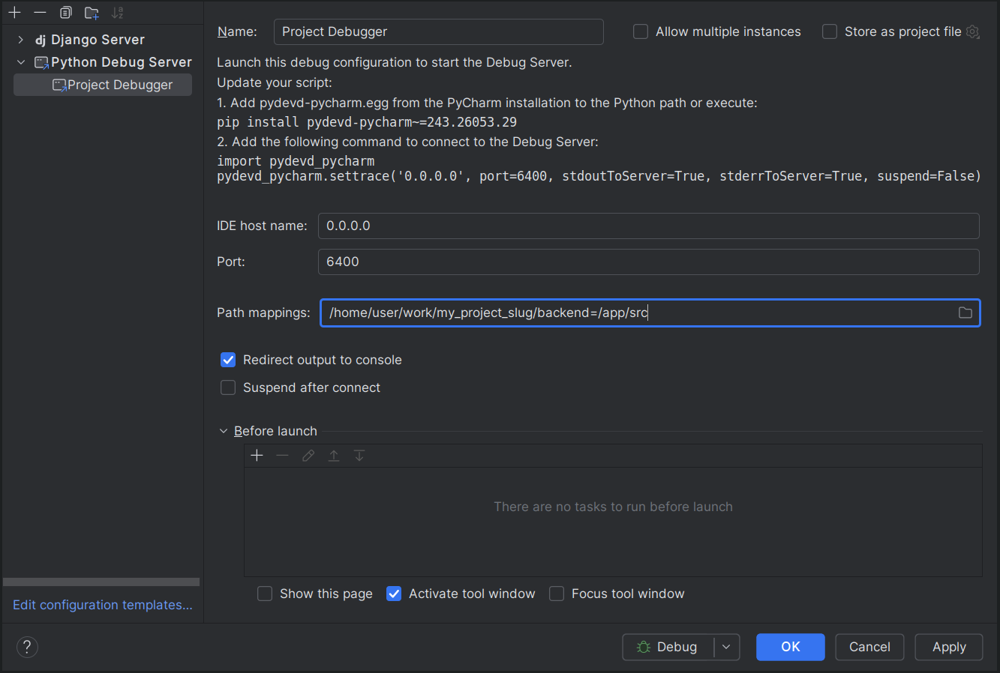

# :bug: How to debug the application

The steps below describe how to set up interactive debugging with PyCharm.

## PyCharm Debugging Setup
Update `k8s/base/app.configmap.yaml` with `data` field `PYTHONBREAKPOINT: "utils.pycharm_debugger"`

In PyCharm:

1. Go to 'Run' in the toolbar
2. Click on 'Edit Configurations'
3. Click on '+' in the top left of the dialog
4. Select 'Python Debug Server'
5. Set the host to 0.0.0.0 and the port to 6400, and the name as you see fit.
6. For 'path mappings' set /path/to/rochescaf/backend=/app/src
7. Check 'Redirect console output to console'
8. Remove check on 'Suspend after connect'.
9. Click 'Ok'



## Debugging in development
Before the code you want to debug, add the following:

```python
breakpoint()
```

You must then set break points in your IDE and call the code as usual to hit them.
